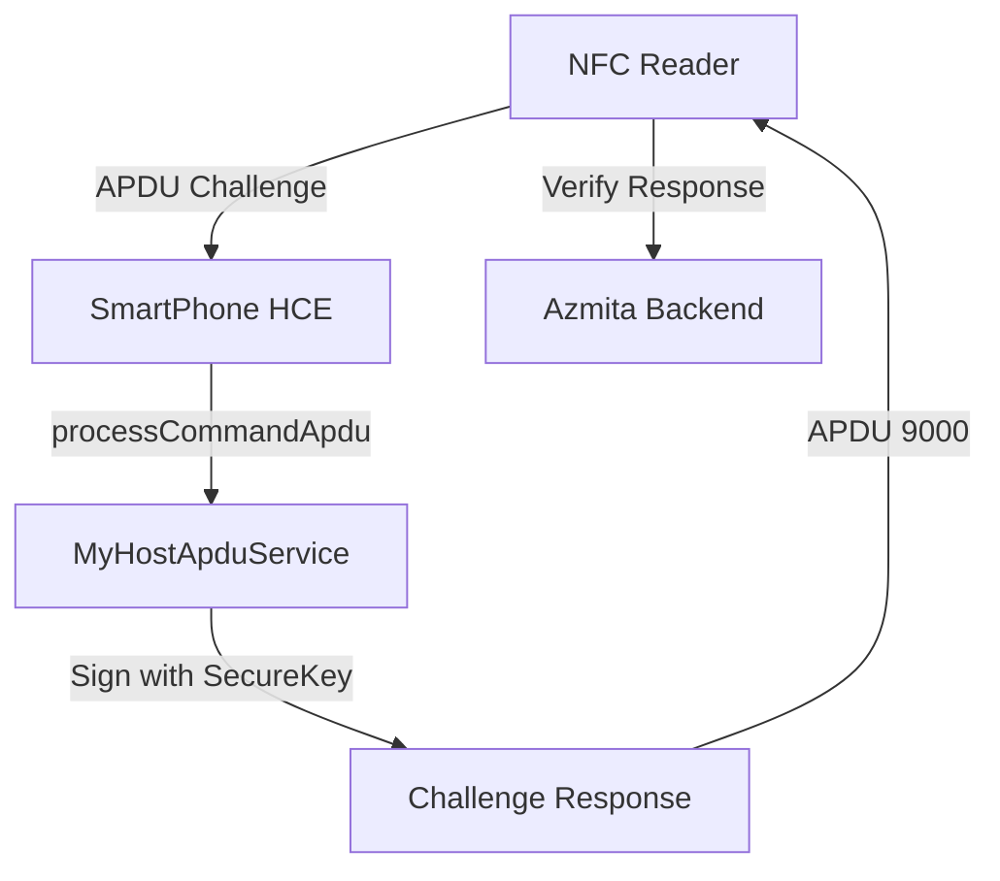

# Android HCE Native Implementation (Kotlin)

This document provides the native implementation required for Host Card Emulation (HCE) on Android, as requested in the integration prompt.

## 1. Android Manifest Configuration
Add the service to your `AndroidManifest.xml` within the `<application>` tag.

```xml
<service
    android:name=".MyHostApduService"
    android:exported="true"
    android:permission="android.permission.BIND_NFC_SERVICE">
    <intent-filter>
        <action android:name="android.nfc.cardemulation.action.HOST_APDU_SERVICE" />
    </intent-filter>
    <meta-data
        android:name="android.nfc.cardemulation.host_apdu_service"
        android:resource="@xml/apduservice" />
</service>
```

## 2. AID Resource (`res/xml/apduservice.xml`)
Define the Application Identifier (AID) that your phone will respond to.

```xml
<host-apdu-service xmlns:android="http://schemas.android.com/apk/res/android"
    android:description="@string/servicedesc"
    android:requireDeviceUnlock="false">
    <aid-group android:description="@string/aiddesc" android:category="other">
        <aid-filter android:name="A0000000010101" /> <!-- Azmita AID -->
    </aid-group>
</host-apdu-service>
```

## 3. HostApduService Implementation (`MyHostApduService.kt`)

```kotlin
package com.azmita.activator

import android.nfc.cardemulation.HostApduService
import android.os.Bundle
import android.util.Log

class MyHostApduService : HostApduService() {

    override fun processCommandApdu(commandApdu: ByteArray?, extras: Bundle?): ByteArray {
        if (commandApdu == null) return hexToByteArray("6E00")

        val hexCommand = byteArrayToHex(commandApdu)
        Log.d("HCE", "Received APDU: $hexCommand")

        // 1. SELECT AID (A0000000010101)
        if (hexCommand == "00A4040007A0000000010101") {
            return hexToByteArray("9000") // Success
        }

        // 2. CHALLENGE-RESPONSE PROTOCOL
        if (hexCommand.startsWith("80CA")) {
            val challenge = hexCommand.substring(4)
            Log.d("HCE", "Challenge Received: $challenge")
            
            // Generate response using internal keys (Secure Enclave approach)
            val response = "52455350" + "ABCDEF123456" // Mock signed response
            return hexToByteArray(response + "9000")
        }

        return hexToByteArray("6E00") // Unknown Command
    }

    override fun onDeactivated(reason: Int) {
        Log.d("HCE", "Deactivated: $reason")
    }

    private fun byteArrayToHex(a: ByteArray): String {
        val sb = StringBuilder(a.size * 2)
        for (b in a) sb.append(String.format("%02X", b))
        return sb.toString()
    }

    private fun hexToByteArray(s: String): ByteArray {
        val len = s.length
        val data = ByteArray(len / 2)
        var i = 0
        while (i < len) {
            data[i / 2] = ((Character.digit(s[i], 16) shl 4) + Character.digit(s[i + 1], 16)).toByte()
            i += 2
        }
        return data
    }
}
```

## 4. Logical Architecture

